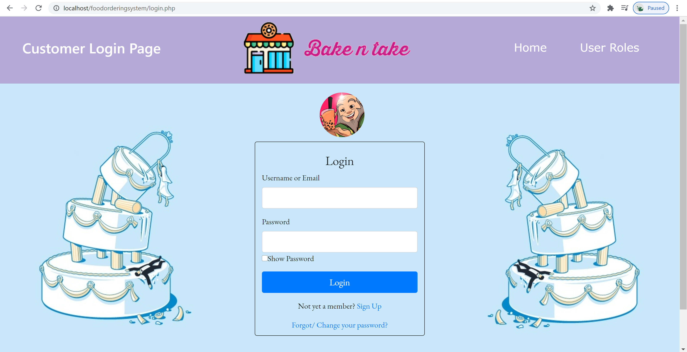
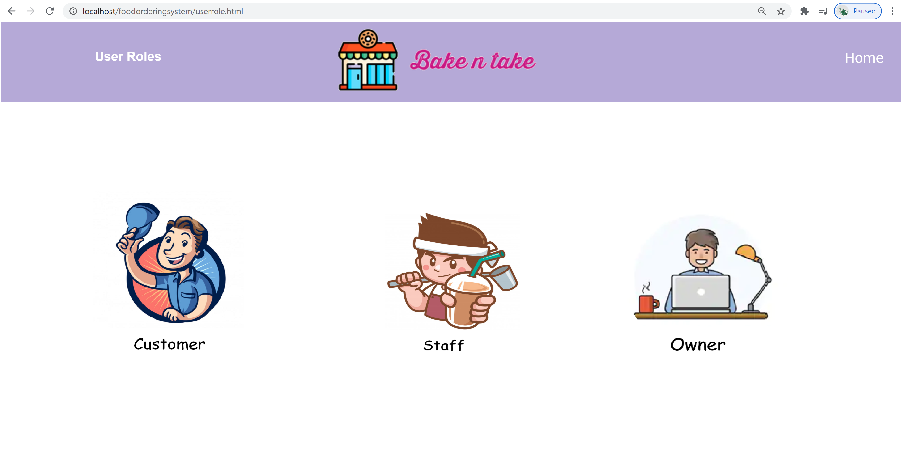
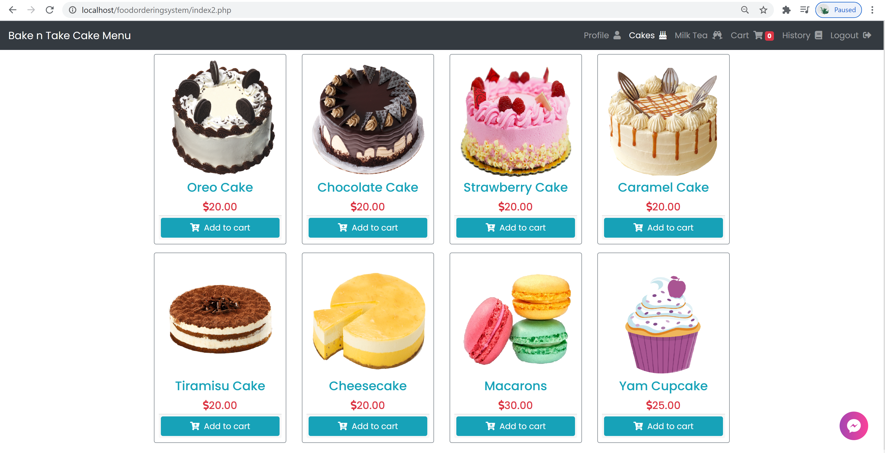
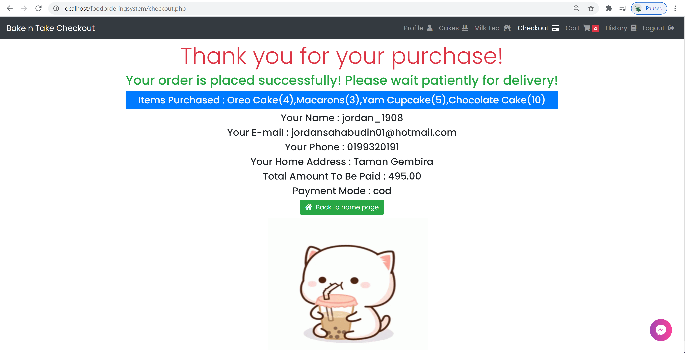
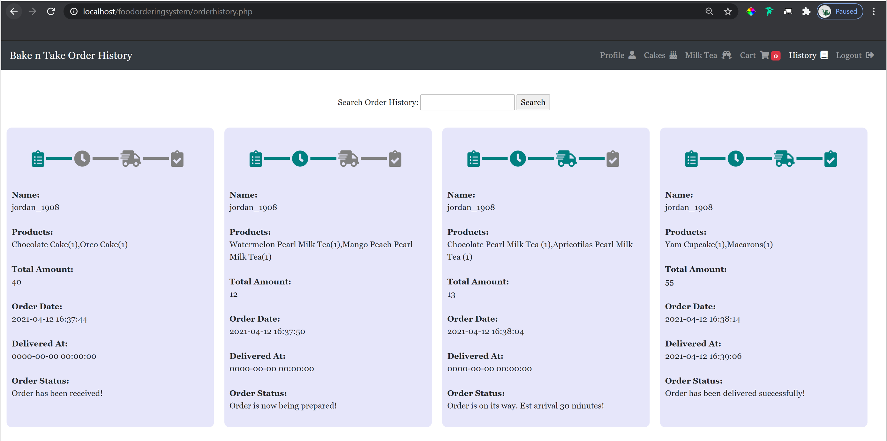

# Online-Food-Ordering-System
It is an E-Commerce/ Food Ordering System for customers to order food and drinks through the online website. Website is coded in PHP, HTML, CSS, JavaScript, AJAX & Bootstrap.   
Note: Only the home page is fully responsive.

* Customer
    •	Login or create an account
•	Verify account through registered email
•	Retrieve forgotten password through registered email
•	View a short introductory of the bakery shop.
•	View cakes and milk tea that are available in the menu
•	Add items into cart
•	Remove items from cart
•	Checkout and make payment
• View delivery status
• Cancel orders placed
•	View order history
•	Logout from account
 
* Staff 
    •	Login into account
• View profile
•	View orders placed by customers 
• Update customer's order status
•	Remove sold out items
•	Modify menu price
• Update daily sales
• Update chatbot system
•	Logout from account

* Owner
    •	Login into account
•	Add new items into menu
• View customer profile
• Update own profile
•	View all orders placed by customers
• View daily sales in bar chart form
• View profit in line chart form
•	Logout from account

## Getting Started
1. Install  [WAMP](https://www.wampserver.com/en/download-wampserver-64bits/) for MySQL server.

2. Import  [cartsystem.sql](/Online-Food-Ordering-System/cartsystem.sql) to phpMyAdmin. 

3. Run the program using local host in default browser.

4. Enter localhost/Online-Food-Ordering-System/php/homepage.php. 

## Screenshot (Customer ONLY)

-----

  <h2>Home Page</h2>

-----

  <h2>Login Page</h2>

-----

  <h2>User Roles</h2>

-----

  <h2>Menu</h2>

-----

  <h2>Shopping Cart</h2>

-----

  <h2>Checkout</h2>

-----

  <h2>Order Status & History</h2>

